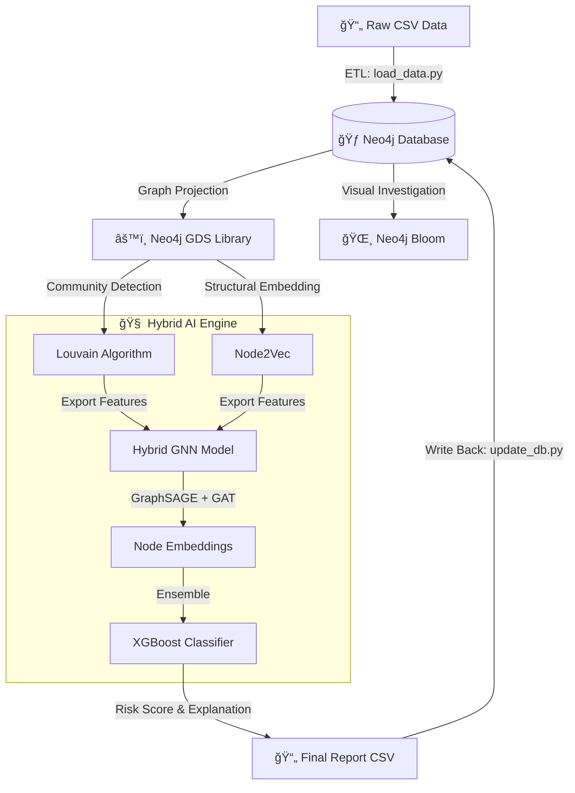

# Grafana: Integrasi Graph Database untuk Fraud Detection dengan Graph Neural Network & Algoritma Louvain

<div align="center">

<table style="border: none; margin: 0 auto; padding: 0; border-collapse: collapse;">
<tr>
<td align="center" style="vertical-align: middle; padding: 10px; border: none; width: 250px;">
  
</td>
<td align="left" style="vertical-align: middle; padding: 10px 0 10px 30px; border: none;">
  <pre style="font-family: 'Courier New', monospace; font-size: 16px; color: #0EA5E9; margin: 0; padding: 0; text-shadow: 0 0 10px #0EA5E9, 0 0 20px rgba(14,165,233,0.5); line-height: 1.2; transform: skew(-1deg, 0deg); display: block;">

░██████╗░██████╗░░█████╗░███████╗░█████╗░███╗░░██╗░█████╗░
██╔════╝░██╔══██╗██╔══██╗██╔════╝██╔══██╗████╗░██║██╔══██╗
██║░░██╗░██████╔╝███████║█████╗░░███████║██╔██╗██║███████║
██║░░╚██╗██╔══██╗██╔══██║██╔══╝░░██╔══██║██║╚████║██╔══██║
╚██████╔╝██║░░██║██║░░██║██║░░░░░██║░░██║██║░╚███║██║░░██║
░╚═════╝░╚═╝░░╚═╝╚═╝░░╚═╝╚═╝░░░░░╚═╝░░╚═╝╚═╝░░╚══╝╚═╝░░╚═╝
  </pre>
</td>
</tr>
</table>

<p>
  
  
  
</p>

<div align="center">
<a href="https://trendshift.io/repositories/14665" target="_blank"></a>
</div>

<div align="center" style="width: 100%; height: 2px; margin: 20px 0; background: linear-gradient(90deg, transparent, #00d9ff, transparent);"></div>
</div>

> **GRAFANA** (Graph Fraud Analytics) adalah sistem deteksi fraud cerdas yang menggabungkan kekuatan **Neo4j Graph Database** dengan arsitektur Deep Learning **GNN** dan klasifikasi komunitas **Louvain**.
>
> Sistem ini tidak hanya memetakan hubungan pasien-klaim, tetapi juga mempelajari pola struktural (embedding) untuk memprediksi anomali dengan akurasi tinggi, divisualisasikan langsung melalui **Neo4j Bloom**.
---

## 📑 **Table of Contents**

* [✨ Features](#-features)
* [🏗️ Architecture](#️-architecture--pipeline)
* [⚙️ Setup Environment](#️-setup-environment)
* [🔗 Graph Model Design](#-graph-model-design)
* [🌐 Visualizations](#-visualizations)
* [👁️ Graph Visualization](#️-graph-visualization)
* [📄 License](#-license)

---

## ✨ **Features**

<table align="center" width="100%" style="border: none; table-layout: fixed;">
<tr>
<td width="33%" align="center" style="padding: 20px;">
<h3>🔗 Knowledge Graph Construction</h3>

<p>Mengubah data tabular mentah menjadi graf cerdas yang menghubungkan entitas <b>Patient dan Claim</b> untuk mengungkap relasi tersembunyi.</p>
</td>
<td width="33%" align="center" style="padding: 20px;">
<h3>🧬 Structural Feature Engineering</h3>

<p>Mengekstraksi fitur graf tingkat lanjut menggunakan algoritma <b>Louvain Community Detection</b>  untuk menangkap konteks komunitas fraud.</p>
</td>
<td width="33%" align="center" style="padding: 20px;">
<h3>🤖 Hybrid AI Prediction</h3>

<p>Model ensemble yang menggabungkan kekuatan induktif <b>GraphSAGE</b> untuk klasifikasi risiko tinggi.</p>
</td>
</tr>
</table>

---

## 🏗️ Architecture & Pipeline



# ⚙️ Setup Environment

Panduan ini menjelaskan seluruh instalasi dari nol hingga siap menjalankan pipeline GRAFANA.

## 🧱 1. System Requirements

* Python ≥ 3.10
* Neo4j Desktop / Neo4j AuraDB
* CUDA (opsional, untuk training GNN)
* Pip & Virtualenv

---

## 🐍 2. Create Virtual Environment

```bash
git clone https://github.com/ahnafyura/GRAFANA
cd GRAFANA
python3 -m venv venv
source venv/bin/activate  # Windows: venv\Scripts\activate
```

## 📦 3. Install Dependencies

```bash
pip install -r requirements.txt
```

Library inti:

* `pandas`
* `py2neo`
* `torch`
* `scikit-learn`
* `torch-geometric`
* `xgboost`
* `node2vec`
---

# 🏗️ Neo4j Setup

## 1. Instalasi Neo4j Desktop

Download: [https://neo4j.com/download/](https://neo4j.com/download/)

Setelah instalasi:

1. Buat database baru
2. Username & password default:
  * neo4j
  * neo4j123
3. Jalankan database

# 🚀 2. Quick Start

Run full ETL, Louvain, and GNN pipeline
```bash
./wrapper.sh
```

Run individual steps
```bash
python -m etl.load
python -m louvain.louvain
python -m etl.export
python -m gnn.hybrid_gnn
```

# 🔗 Graph Model Design

## Node Types

* **Claim**
* **Patient**

# 👁️ Graph Visualization

## Neo4j Browser

Melihat 50 Claim:

```cypher
MATCH (c:Claim)-[r]-(n)
RETURN * LIMIT 50;
```

---

## 📄 **License**

MIT License
